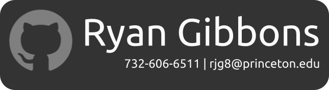

## Welcome to my Github page! My name is Ryan.
#### About Me
- 🎓 I'm currently a junior at **Princeton University**, where I'm studying Computer Science and pursuing a minor in Linguistics.
- ⭐️ Academically, I'm most excited about using computer science to create and analyze linguistic models and ultimately better understand how we comprehend language. 
- 🖥 I've recently found myself passionate about the field of **computer graphics**. I'm compelled not only by its many applications, but also by how it demands the intersection of computer science, math, art, physics, and more in an attempt to capture the world around us (or other worlds altogether).
#### Read More
- 💬 <a href="10-5 Resume RG.pdf" download>Resume</a>
- 🤝 <a href="https://www.linkedin.com/in/ryanjamesgibbons/"> LinkedIn </a>

<!--
**Ryan-Gibbons/Ryan-Gibbons** is a ✨ _special_ ✨ repository because its `README.md` (this file) appears on your GitHub profile.

Here are some ideas to get you started:

- 🔭 I’m currently working on ...
- 🌱 I’m currently learning ...
- 👯 I’m looking to collaborate on ...
- 🤔 I’m looking for help with ...
- 💬 Ask me about ...
- 📫 How to reach me: ...
- 😄 Pronouns: ...
- ⚡ Fun fact: ...
-->
